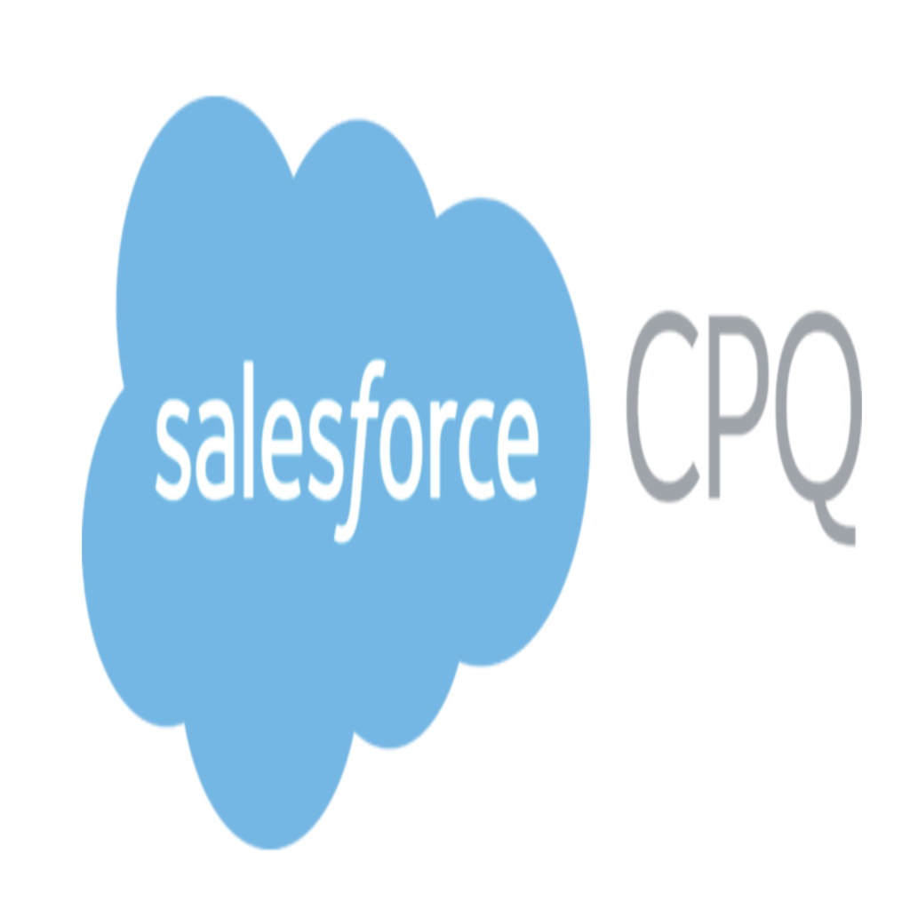

<!-- Personal Info -->
# 👋 Hi, I’m Bindu Pagad

🎯 Salesforce Developer with 4+ years of experience across **Sales, Service, Health**, and **Experience Cloud**.

💡 Passionate about building scalable, API-first solutions using **Apex, LWC, JavaScript, REST APIs, AWS**, and **Heroku**.

---

### 🔗 Quick Links
- 📄 [View My Resume](BinduPagad.pdf)
- 🔗 [LinkedIn](https://www.linkedin.com/in/bindu-pagad)
- 💻 [GitHub](https://github.com/MissPagad)
- 📬 [Email Me](mailto:bindupagad181997@gmail.com)

---

## 🚀 Projects

  <!-- Project 1 -->
 

  
  <h3 style="color:#003366;">Salesforce & Boomi Integration</h3>
  
Automated Contact Sync from Salesforce to Gmail with Boomi.

  <a href="SalesforceBoomi.pdf" target="_blank" style="color:#003366;">PDF</a>

  <!-- Project 2 -->
 <!-- 

    
    <h3>SmartCloud CPQ – Pro SaaS Subscription Configuration</h3>
    
Salesforce CPQ to model a tiered SaaS pricing and bundling system for a fictional B2B software company.

    <a href="SalesforceCPQ.pdf" target="_blank">PDF</a>
  
-->

