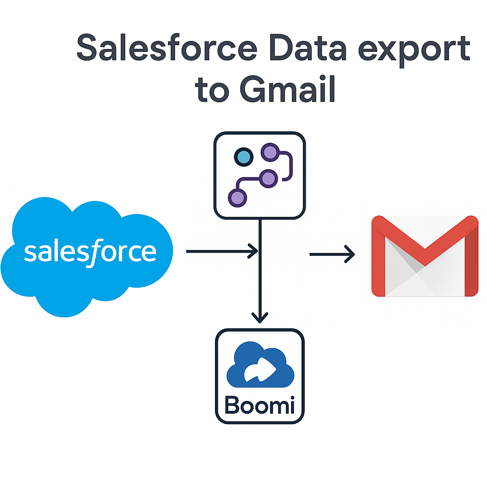
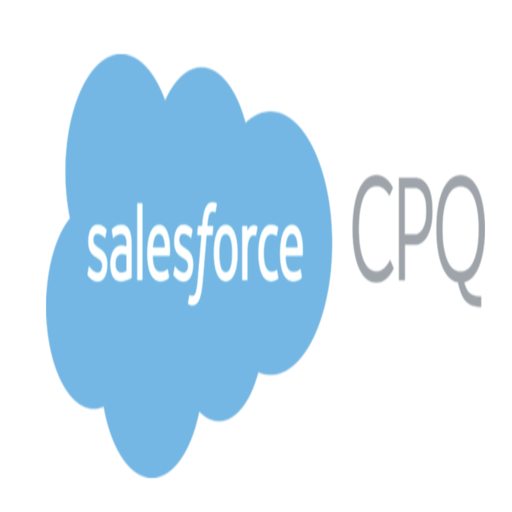
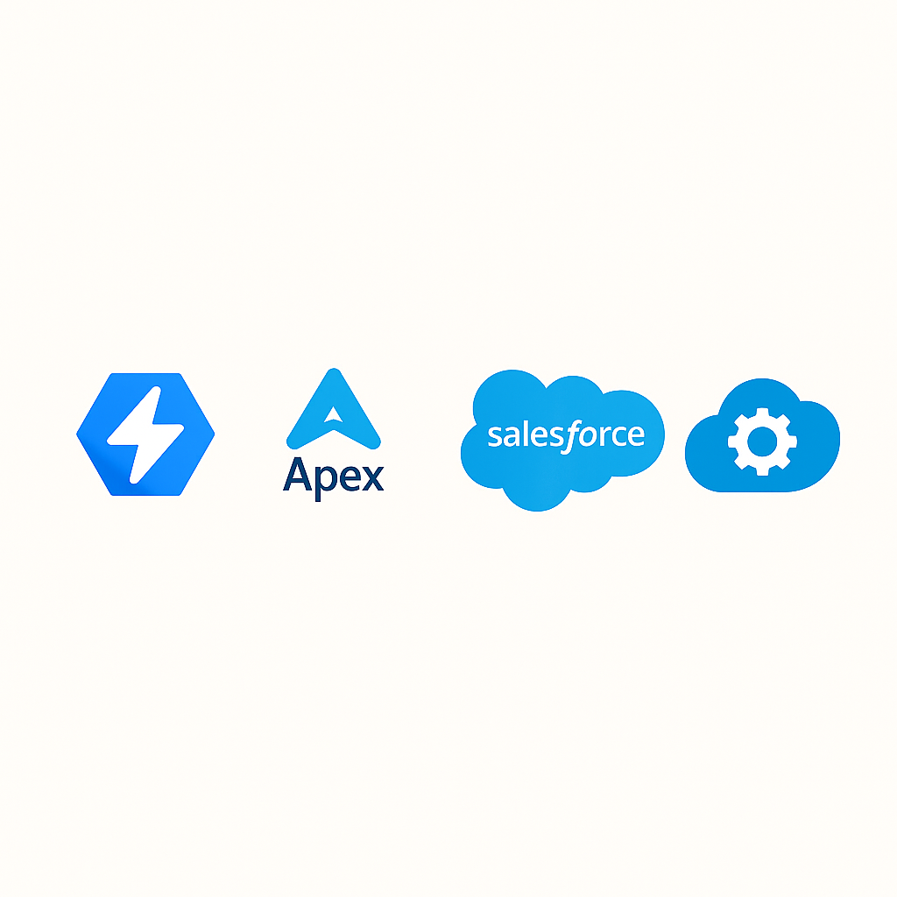
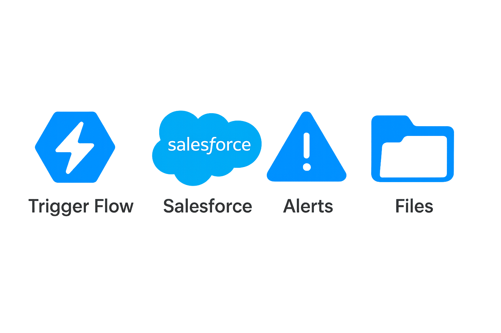

<!-- Personal Info -->
# 👋 Hi, I’m Bindu Pagad

🎯 I have extensive Salesforce development experience across **Sales, Service, Health**, and **Experience Cloud**, holding 5 Salesforce certifications.

💡 Passionate about building scalable, API-first solutions using **Apex, LWC, JavaScript, REST APIs, AWS**, and **Heroku**. 
As a dedicated Salesforce enthusiast, I embrace new challenges within the dynamic Salesforce ecosystem.

---

### 🔗 Quick Links
- 📄 [View My Resume](BinduPagad.pdf)
- 🏆 [Salesforce Certifications](BinduPagadCertifications.pdf)
- 🌟 [Trailhead Profile](https://www.salesforce.com/trailblazer/bpagad)
- 🔗 [LinkedIn](https://www.linkedin.com/in/bindu-pagad)
- 💻 [GitHub](https://github.com/MissPagad)
- 📬 [Email Me](mailto:bindupagad181997@gmail.com)

---

## 🚀 Projects

  <!-- Project 1 -->
 

  
  <h3 style="color:#003366;">Salesforce & Boomi Integration</h3>
  
Automated Contact Sync from Salesforce to Gmail with Boomi.

  <a href="SalesforceBoomi.pdf" target="_blank" style="color:#003366;">PDF</a>

  <!-- Project 2 -->
 

    
    <h3 style="color:#003366;">SmartCloud CPQ – Pro SaaS Subscription Configuration</h3>
    
Salesforce CPQ to model a tiered SaaS pricing and bundling system for a fictional B2B software company.

    <a href="Salesforcecpq.pdf" target="_blank" style="color:#003366;">PDF</a>
  

  <!-- Project 3 -->
 

    DragCase – Dynamic Service Workflow" style="width: 100%; border-radius: 4px;">
    <h3 style="color:#003366;">DragCase – Dynamic Service Workflow</h3>
    
A drag-and-drop, real-time Case workflow component reusable across Contact & Account record pages.

    <a href="DragCaseWorkFlow.pdf" target="_blank" style="color:#003366;">PDF</a>
   <a href="https://github.com/MissPagad/ServiceCloudWorkflow.git" target="_blank" style="color:#003366;">GitHub</a>
  

 <!-- Project 4 -->
 

    File Management Automation" style="width: 100%; border-radius: 4px;">
    <h3 style="color:#003366;">File Management Automation</h3>
    
Automation to copy files from Opportunities to their related Accounts, ensuring seamless document accessibility.

    <a href="CDLAutomation.pdf" target="_blank" style="color:#003366;">PDF</a>
  

  <!-- Project 5 -->
 

    Cadence Creator for Salesforce" style="width: 100%; border-radius: 4px;">
    <h3 style="color:#003366;">Cadence Creator for Salesforce</h3>
    
Automation to copy files from Opportunities to their related Accounts, ensuring seamless document accessibility.

    <a href="https://github.com/MissPagad/CadenceCreatorWorkflow.git" target="_blank" style="color:#003366;">GitHub</a>
    <a href="CadenceCreator.pdf" target="_blank" style="color:#003366;">PDF</a>
  

